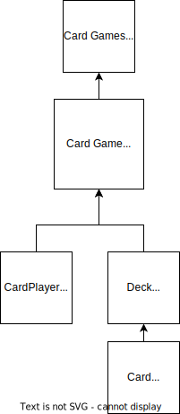

# Card Game

Hello, Here is my submission. I made it in Spring boot using Junit
for unit testing. There's definitely improvements to be made but given 
the time constraints, I hope it would be ok to leave it like this.
Here is a High level diagram to help understand where I placed things.

Also you will see a gitlab-ci.yml file but i didnt realize before making it 
that Pipelines are a "premium" feature on github. Thats why theres no 
lint or anything.

-Rachel
